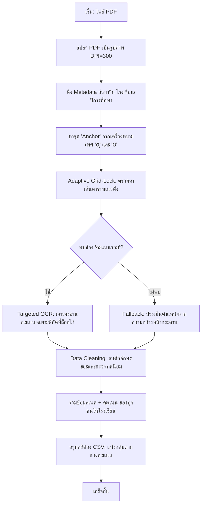

# Project Roadmap & Technical Architecture

โปรเจกต์นี้มีวัตถุประสงค์เพื่อแปลงข้อมูลสถิตินักเรียนจากไฟล์ PDF ภาษาลาว (ซึ่งมีความซับซ้อนสูง) ให้เป็นเอกสาร CSV ที่พร้อมใช้งาน สรุปขั้นตอนและวิถีการทำงานดังนี้ครับ

## 1. Flowchart: กระบวนการสกัดข้อมูล (Logic Flow)

---

## 2. Roadmap: เส้นทางการพัฒนา

### Phase 1: Foundation (การวางรากฐาน)
- ติดตั้งระบบ OCR (Tesseract) และเครื่องมือประมวลผล PDF (Poppler)
- เขียนโค้ดเบื้องต้นเพื่อดึงข้อความดิบ (Raw Text) ออกมาตรวจสอบโครงสร้าง

### Phase 2: Layout Awareness (การเข้าใจโครงสร้าง)
- พัฒนาระบบ **Visual Anchoring** เพื่อหาตำแหน่งข้อมูลจากรูปภาพแทนการอ่านข้อความบรรทัดต่อบรรทัด
- สร้างฟังก์ชันตรวจจับเส้นตาราง (Grid Detection) เพื่อรับมือกับหน้าที่เอียงหรือข้อความที่ไม่อยู่ในบรรทัดตรงกัน

### Phase 3: Accuracy Refinement (การปรับจูนความแม่นยำ)
- พัฒนา **Targeted Recovery Pass**: เทคนิคการครอปภาพขนาดเล็กแล้วขยาย 5 เท่าเพื่ออ่านตัวเลขที่ชิดเส้นตาราง
- เพิ่มระบบรองรับภาษาลาว (Lao Language Support) ในส่วนหัวกระดาษ

### Phase 4: Scaling & Verification (การขยายผลและตรวจสอบ)
- เพิ่มระบบ **Multiprocessing** เพื่อให้สามารถประมวลผลไฟล์ขนาดใหญ่ได้เร็วขึ้น (รันหลายหน้าพร้อมกัน)
- สร้างระบบ Debugging ที่บันทึกภาพการทำงานในแต่ละหน้าเพื่อการตรวจสอบย้อนกลับ

---

## 3. Technology Stack: เครื่องมือที่ใช้

| เครื่องมือ | หน้าที่ | ทำไมถึงเลือกใช้? |
| :--- | :--- | :--- |
| **Python** | แกนหลักของโปรแกรม | มี Library สำหรับการจัดการข้อมูลและรูปภาพที่แข็งแรงมาก |
| **OpenCV (cv2)** | ประมวลผลรูปภาพ | ใช้ในการหาเส้นตาราง, ปรับความคมชัด, และครอปภาพเฉพาะจุด |
| **Tesseract OCR** | อ่านตัวอักษร | รองรับภาษาลาวได้ดี และสามารถกำหนดโหมดการอ่านตัวเลขได้แม่นยำ |
| **PDF2Image** | แปลง PDF | เปลี่ยนเวกเตอร์ PDF ให้เป็นบิตแมปความละเอียดสูง (300DPI) |
| **Polars** | จัดการข้อมูล | เร็วกว่า Pandas มากในการสรุปผลข้อมูลสถิติขนาดใหญ่ |

---

## 4. สิ่งที่ควรต้องรู้ (Required Knowledge)

1.  **Image Processing พื้นฐาน**: เข้าใจความแตกต่างของภาพ Grayscale, Binary และการทำ Threshold เพื่อเตรียมภาพก่อนเข้า OCR
2.  **Regular Expressions (Regex)**: มีความสำคัญมากในการกรองชื่อโรงเรียนหรือข้อมูลส่วนหัวจากข้อความที่อ่านได้ไม่สมบูรณ์
3.  **OCR Modes**: การเลือกใช้ **Page Segmentation Modes (PSM)** เช่น PSM 7 (Single Word) หรือ PSM 6 (Text Block) ให้เหมาะกับตำแหน่งงาน
4.  **Lao Language Character Mapping**: การทำความเข้าใจข้อผิดพลาดทั่วไปของ OCR ในภาษาลาว เช่น การอ่าน 'ມ' เป็น 'ນ' หรือ 'ລ' เป็น 'ລວ' เพื่อเขียนโค้ดรองรับ

## 5. เคล็ดลับเพื่อประสิทธิภาพสูงสุด (Tips & Best Practices)

- **การใช้ Multiprocessing**: หากเครื่องมี CPU หลายคอร์ ควรใช้ Flag `--cores 4` (หรือมากกว่า) เพื่อลดเวลาประมวลผลได้มหาศาล (หน้าละประมาณ 1-2 วินาที)
- **การตรวจสอบย้อนหลัง**: หากพบว่าตัวเลขใน CSV ดูผิดปกติ ให้เช็คในโฟลเดอร์ `debug_output` ระบบจะสร้างภาพที่มีการวาดเส้นเชื่อมพิกัดและตัวเลขที่อ่านได้ในหน้านั้นๆ เพื่อให้คุณตรวจสอบได้ว่าระบบ "เห็น" อะไร
- **คุณภาพ PDF**: ไฟล์ PDF ที่มี DPI ต่ำกว่า 200 อาจทำให้ความแม่นยำลดลง แนะนำให้ใช้ไฟล์ต้นฉบับที่คมชัดที่สุด

## 6. ข้อจำกัดและสิ่งที่ควรระวัง (Limitations)

- **ลายมือเขียน (Handwriting)**: ระบบนี้ถูกออกแบบมาเพื่ออ่าน "ตัวพิมพ์" เท่านั้น ไม่รองรับการอ่านลายมือเขียน
- **ความสะอาดของเอกสาร**: หากมีรอยขีดทับตัวเลข หรือรอยพับขนาดใหญ่ที่บังเส้นตาราง อาจทำให้ Grid-Lock คลาดเคลื่อนได้
- **โครงสร้างตารางที่เปลี่ยนไป**: หากเปลี่ยนไปใช้ PDF ของปีอื่นที่มีการเรียงคอลัมน์ต่างจากเดิมอย่างสิ้นเชิง อาจต้องปรับแก้พิกัดการหาหัวตารางเพิ่มเติม

## 7. แนวทางการพัฒนาในอนาคต (Future Scope)

- **Database Integration**: เชื่อมต่อเข้ากับระบบ MSSQL เพื่อเก็บข้อมูลแบบถาวรแทนไฟล์ CSV
- **Web Dashboard**: สร้างหน้าเว็บด้วย Next.js หรือ Vite เพื่อแสดงผลสถิติเป็นกราฟวงกลมหรือกราฟแท่งแบบ Interactive
- **Auto-Correction System**: เพิ่มระบบ AI (LLM) เพื่อช่วยตรวจสอบความสมเหตุสมผลของชื่อโรงเรียนหรือชื่อแขวงที่ OCR อ่านผิด

---
*จัดทำโดย: Antigravity AI Assistant*
